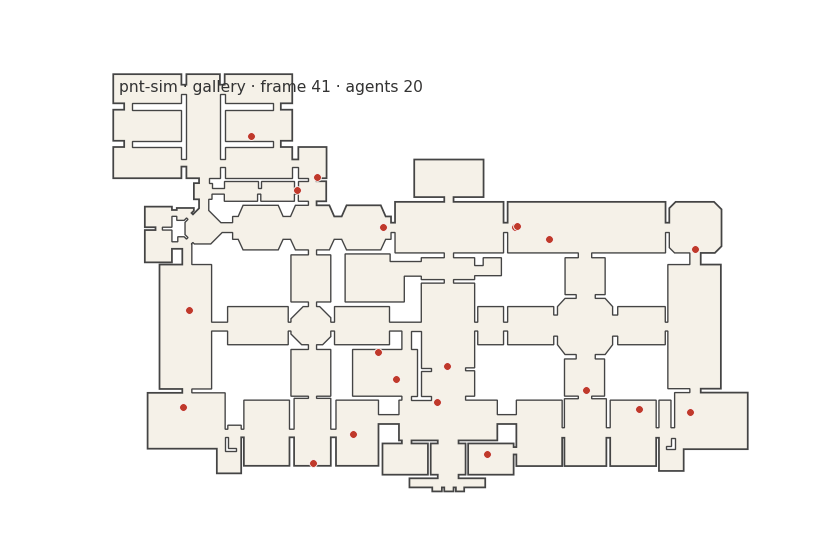

# pnt-sim

Penn & Turner space-syntax agent simulator. Standalone tool: consumes a
Web-Based JuPedSim scenario (`config.json` + `geometry.wkt`), runs the EVA
agent model (Turner & Penn 2002), writes a JuPedSim-format sqlite trajectory
the web app can visualise without changes.



*40 agents wandering an art-gallery layout. No goals, no planning — each
agent samples a visible cell within its FOV cone, walks toward it, repeats.*

## Algorithm

Per Turner & Penn (2002), default parameters:

1. Discretize the walkable area into a Cartesian grid.
2. Pre-compute per-cell visibility: which other cells are visible (straight
   line not blocked by walls or obstacles).
3. Each agent has continuous position, heading, and a remaining lifetime.
   On spawn it picks an initial target uniformly from its cell's full
   visible set (omni — no FOV cone, since there's no prior heading).
   Every K steps thereafter (default 3), or on arrival, it re-picks:
   filter the visible set to a ±FOV/2 cone around the heading (default
   FOV 170°), sample one uniformly. Heading is updated to point at the
   new target.
4. Each frame the agent advances `step_length` (default = grid spacing)
   along its current heading. Movement is continuous, not grid-snapped;
   the grid only defines the visibility lookup.
5. Agents are released at a configurable rate (per timestep) until either the
   max-agents cap is reached or the simulation ends.

Agents pass through each other — the model measures space syntax, not
crowd dynamics. Collision avoidance is intentionally omitted.

## Fidelity to Turner & Penn (2002), Figure 8

Each node of T&P's flow-chart maps to a corresponding step in
`pnt_sim/agents.py::_advance_agent`. Movement is continuous rather than
cell-snapped, but the decision structure is preserved one-to-one.

| T&P Figure 8                                          | This implementation                                                                                              | Status |
| ----------------------------------------------------- | ---------------------------------------------------------------------------------------------------------------- | ------ |
| Initial: *Select a visible destination* (omni)        | `spawn()` samples uniformly from the full visible set; heading derives from the pick.                            | ✓      |
| *Have less than n-steps been taken?*                  | `steps_until_decision` counter, decremented on each successful step.                                             | ✓      |
| *Select a new visible destination from FOV*           | `_redecide(omni=False)` filters the visible set to a ±FOV/2 cone around the heading and samples uniformly.       | ✓      |
| *Is a step toward the destination possible?*          | `_segment_clear(pos, pos + step·heading)` — tests the candidate step against all wall segments via an STRtree.   | ✓      |
| *Take a step toward the destination*                  | `_take_step(heading)` advances `step_length` along the heading.                                                  | ✓      |
| *Is a side step possible?*                            | `_take_step(heading ± π/2)` with a random sign chosen first, falling back to the other side.                     | ✓      |
| *Take a side step*                                    | Same call as above on success.                                                                                   | ✓      |
| Stuck → reselect *visible destination* (omni)         | `_redecide(omni=True)` — omni reselection (no FOV cone), exactly the "back to top" arrow in Figure 8.            | ✓      |
| (not in T&P)                                          | Extra: re-decide on arrival at the target. Continuous-space shortcut for what T&P reaches via step-not-possible → side-step → reselect at the target. | ➕ extension |

The only material deviation from the published algorithm is that motion
is continuous (advance `step_length` along the heading per frame) rather
than grid-cell stepping. The decision graph, the FOV-cone reselect, the
step/side-step blockage check, and the omni-reselect-when-stuck all match
Figure 8.

## Parameters

| CLI flag              | Default          | Meaning                                                                                                                                              |
| --------------------- | ---------------- | ---------------------------------------------------------------------------------------------------------------------------------------------------- |
| `--wkt`               | *(required)*     | Path to the walkable-area geometry as WKT (outer ring + holes).                                                                                      |
| `--json`              | *(optional)*     | JuPedSim scenario `config.json`. Only consulted when `--release-mode distributions` (supplies the named release-zone polygons); otherwise ignored.   |
| `--out`               | *(required)*     | Output sqlite trajectory file (JuPedSim v3 schema).                                                                                                  |
| `--grid`              | `0.5` m          | Cartesian grid spacing for the visibility lattice. Smaller = finer routes, quadratic-in-N cost on the visibility precompute.                         |
| `--clearance`         | `0.1` m          | Minimum distance a grid cell must keep from any wall. Prevents agents from clipping corners.                                                         |
| `--fov-deg`           | `170°`           | Field-of-view cone, full angle. At each re-decide the visible set is filtered to ±FOV/2 around the heading. T&P's tuned value.                       |
| `--steps-before-turn` | `3`              | The *n* in T&P's "have less than n-steps been taken?" — how many frames an agent commits to its current target before re-deciding.                   |
| `--step-length`       | = `--grid`       | Distance walked per frame in metres. Defaults to one grid spacing so motion roughly matches the original grid-step model.                            |
| `--release-rate`      | `0.1` agents/frame | Spawn rate. Fractional values are honoured via Bernoulli (floor + extra w.p. fractional part).                                                       |
| `--release-mode`      | `uniform`        | `uniform` = sample any visible grid cell. `distributions` = sample inside the scenario's release-zone polygons (falls back to uniform if absent).    |
| `--max-agents`        | `50`             | Hard cap on concurrently alive agents. Spawning pauses while at the cap.                                                                             |
| `--timesteps`         | `5000`           | Number of simulation frames to run.                                                                                                                  |
| `--agent-lifetime`    | `1000` frames    | Each agent is removed after this many frames. Mimics T&P's bounded visitation samples.                                                               |
| `--fps`               | `10.0`           | Frame rate stamped into the output metadata (does not affect the simulation, only the playback timeline).                                            |
| `--seed`              | `None`           | RNG seed. With a seed, the run is reproducible; without one, NumPy seeds from system entropy.                                                        |
| `--cache`             | `<out>.visibility.pkl` | Where to read/write the visibility precompute. Cache is keyed on geometry-hash + grid + clearance.                                                   |

## Install

```bash
cd pnt-sim
pip install -e .
```

## Run

```bash
pnt-sim \
  --wkt scenario/geometry.wkt \
  --out trails.sqlite \
  --grid 0.5 --fov-deg 170 --steps-before-turn 3 \
  --release-rate 0.1 --max-agents 50 --timesteps 5000 \
  --agent-lifetime 1000 --seed 42
```

Only `--wkt` is required. `--json scenario/config.json` is consulted **only**
when running with `--release-mode distributions` (it supplies the named
release-zone polygons). Under the default `--release-mode uniform`, agents
spawn on any visible grid cell and the JSON file is not needed.

Visibility pre-compute is cached next to the output as
`<out>.visibility.pkl` keyed on geometry hash + grid spacing; subsequent
runs with the same geometry+grid skip it.

## Output

A sqlite file in JuPedSim's v3 schema (`trajectory_data`, `metadata`,
`geometry`, `frame_data`, `levels`, `landings`). Open it in the
[Web-Based JuPedSim viewer](https://app.jupedsim.org) alongside the original scenario.

## References

- Turner, A., Penn, A. (2002). Encoding Natural Movement as an Agent-based
  System. *Environment and Planning B* 29(4), 473–490.
- Turner, A. (2007). To Move Through Space: Lines of Vision and Movement.
  *Proc. 6th Intl. Space Syntax Symposium*, Istanbul.
